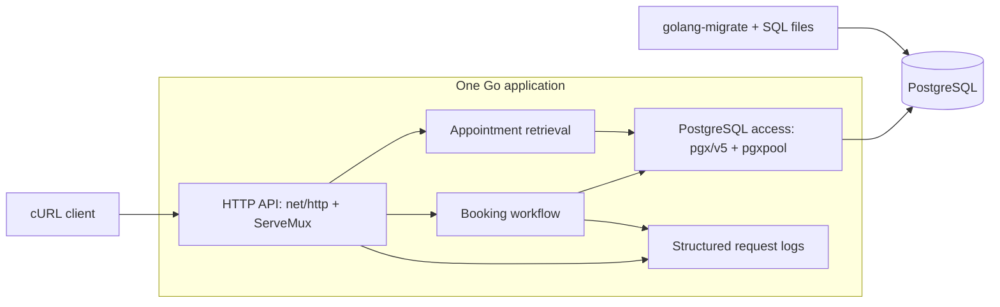

# Architecture

## Status and purpose

This document describes the selected design for the Unified Service Scheduler. It covers the architecture, component responsibilities, data flow, technology choices, observability strategy, and GenAI use during design.

The design choices below are recorded in [My decision](plan.md#my-decision). Domain assumptions and the [API contract](api/README.md) are confirmed. Implementation and verification are pending; exact runtime and dependency versions will be pinned during setup.

## Requirements

An appointment request identifies a customer, vehicle, dealership, service type, and desired start time. Before confirmation, the service must find a qualified technician and service bay available for the entire service duration. A successful booking persists those associations.

The design must protect against overlapping bookings through the supported API and make its assumptions and limitations explicit.

## Architecture diagram

The diagram represents the target implementation. It does not indicate deployed components or completed functionality.

## Components

| Component | Location | Responsibility |
| --- | --- | --- |
| Application entry point | `cmd/api/` | Load configuration, connect dependencies, start the HTTP server, and shut down cleanly. |
| HTTP API | `internal/httpapi/` | Route requests, decode and validate input, attach request IDs, and map results to HTTP responses. |
| Booking workflow | `internal/appointments/` | Coordinate reference validation, duration calculation, resource allocation, and appointment creation. |
| Catalog model | `internal/catalog/` | Represent customers, vehicles, dealerships, service types, technicians, qualifications, and bays. |
| PostgreSQL access | `internal/postgres/` | Execute SQL, own transaction handling, and retrieve persisted appointments. |
| Configuration | `internal/config/` | Load and validate connection and server settings. |
| Schema and seed data | `database/` | Apply versioned migrations and load reproducible demonstration data. |

These are packages within one application, not independent services. Booking code should express the business workflow without depending on HTTP response details.

## Selected technologies and rationale

| Choice | Rationale |
| --- | --- |
| Go | Selected implementation language for a single backend service. |
| `net/http` and `http.ServeMux` | Standard-library HTTP handling keeps the two-endpoint API small. See the [Go HTTP documentation](https://pkg.go.dev/net/http#ServeMux). |
| PostgreSQL | Relational persistence and transactions for the appointment and its resource associations. |
| `pgx/v5` and `pgxpool` | Explicit PostgreSQL access, transactions, and pooled connections. See the [pgxpool documentation](https://pkg.go.dev/github.com/jackc/pgx/v5/pgxpool). |
| `golang-migrate` and SQL files | Versioned schema changes that remain readable alongside the transaction queries. See the [migration project](https://github.com/golang-migrate/migrate). |
| cURL | A repeatable client demonstration without a separate frontend. |

Dependency and runtime versions will be pinned during setup. SQL keeps overlap checks and the locking protocol visible for review.

## Booking data flow

1. Accept `POST /appointments`, validate positive integer IDs and an RFC 3339 start time with a timezone offset, normalize it to UTC, and require a future start time.
2. Begin a `READ COMMITTED` transaction through a pooled connection.
3. Lock the requested dealership row using `SELECT ... FOR UPDATE`. A missing dealership produces a missing-record outcome.
4. After obtaining the lock, validate catalog references and the vehicle's association with the supplied customer. Read the selected service duration and derive the appointment end time.
5. Select a qualified technician and available bay at the requested dealership, considering the entire interval and alternative resources when a candidate is occupied.
6. If either resource is unavailable, roll back and return a capacity-conflict outcome.
7. Insert the appointment with both assignments and commit. After commit succeeds, return `201 Created`, a `Location` header, and the appointment representation.

All statements in this operation must use the same transaction, not independent pool calls. Every failure path must release the transaction through rollback or completion.

`GET /appointments/{id}` returns `200 OK` with the same persisted appointment representation, without allocating resources. All returned timestamps are UTC RFC 3339 strings. See the confirmed [API contract](api/README.md) for fields and error codes.

## Data model

| Entity | Responsibility |
| --- | --- |
| Customer | Customer associated with the booking. |
| Vehicle | Seeded vehicle receiving service, associated with a customer. |
| Dealership | Resource location and booking lock boundary. |
| ServiceType | Service duration and qualification association. |
| Technician | Technician assigned to one dealership. |
| TechnicianQualification | Direct association between a technician and an eligible service type. |
| ServiceBay | Bay assigned to one dealership. |
| Appointment | Customer, vehicle, dealership, service type, technician, bay, interval, and confirmed status. |

Catalog data is seeded and static. IDs are positive integers; appointment IDs are assigned by the server. Each vehicle is associated with a customer, and booking validates that association. The schema must preserve required relationships and valid intervals. Exact database column types and indexes remain implementation details.

## Concurrency decision

All booking transactions acquire the dealership row lock before reading availability. Bookings at the same dealership therefore execute their allocation checks in sequence. Different dealerships have different lock rows.

At `READ COMMITTED`, later statements can observe changes committed before those statements start. After a waiting request acquires the dealership lock, its subsequent availability queries see the previous booking. This is the intended use of PostgreSQL's [row locks](https://www.postgresql.org/docs/current/explicit-locking.html#LOCKING-ROWS) and [statement snapshots](https://www.postgresql.org/docs/current/transaction-iso.html#XACT-READ-COMMITTED).

The guarantee depends on every booking writer using this protocol, each resource belonging to one dealership, and static catalog data. An in-process mutex is not the concurrency authority. The design must be verified with independent PostgreSQL connections.

### Tradeoffs and limits

- Requests for different resources at the same dealership still wait for one another. Keep the transaction short and bound waits with timeouts.
- Independent resource pairs can both succeed; serialization must not produce false capacity conflicts.
- Direct SQL writes that bypass the protocol are not protected by the locking workflow.
- A lost response after commit leaves the client uncertain about success. Automatic retries and idempotency are outside scope.
- The implementation does not claim a measured throughput or production capacity.

This choice prioritizes a small, reviewable transaction boundary. No comparison of multiple concurrency implementations is planned.

## Scope

Confirmed scope: two endpoints, seeded static catalog, confirmed-only appointments, server-side resource allocation, and a cURL client.

Authentication, catalog administration, cancellation, rescheduling, reservation holds, caching, notifications, and a separate availability endpoint are excluded. This is an assessment implementation, not a complete dealership scheduling product.

## Assumptions

The following assumptions are confirmed for the implementation.

### Time

Appointment start times use RFC 3339, must include a timezone offset, and are normalized to UTC by the application. Service duration is defined by the selected service type, and the server derives the appointment end time.

Appointment intervals use half-open semantics `[start, end)`, allowing back-to-back appointments. Start times must be in the future.

### Working Hours

For the scope of this assessment, technicians and service bays are assumed to be continuously available unless occupied by another appointment. Technician shifts, dealership opening hours, breaks, holidays, and bay maintenance schedules are outside scope.

### Customer and Vehicle

Customers and vehicles are seeded reference data. Each seeded vehicle is associated with a customer. The service validates that the requested vehicle belongs to the supplied customer before creating an appointment. Authentication and customer identity verification are outside scope.

## Observability and failure handling

Planned implementation:

- Structured logs with request ID, operation, outcome, duration, and appointment ID when available.
- Correlation between HTTP requests and transaction failures without logging customer contact data or complete request bodies.
- Bounded request/database waits, controlled error responses, and clean shutdown.
- Errors contain an `error` object with `code`, `message`, and `request_id`; logs carry the same request ID. Invalid input maps to `400`, missing records to `404`, capacity conflicts to `409`, known dependency unavailability to `503`, and unexpected failures to `500`.
- README instructions for checking startup, connectivity, migrations, and database failures.

Metrics strategy: count booking attempts, successes, capacity conflicts, and unexpected failures; measure request and transaction duration. Logs provide initial diagnostic evidence. No metrics exporter or dashboard is in scope.

Tracing strategy: request IDs correlate operations in this single service. Distributed tracing is not planned. No logs, metrics, or traces have been implemented yet.

## Verification strategy

Business tests will cover qualification, dealership matching, timezone normalization, past starts, service-derived end times, interval boundaries, customer/vehicle matching, alternate resources, and persisted associations. Integration tests will exercise the actual PostgreSQL transaction, including rollback and competing requests for a single eligible resource pair.

The concurrency test must use multiple database connections and verify committed appointments as well as responses. A clean-setup rehearsal will verify the documented commands and persistence across restart. See the [test plan](tests/README.md).

## GenAI use during design

AI assisted with requirements analysis, scope comparison, identifying booking invariants, and drafting component boundaries. I selected the technologies and transaction strategy and limited the scope to a complete submission within the available time.

Review clarified that both resources must be allocated atomically and that availability checks must follow the dealership lock. The design records its contention and response-loss limitations. Implementation correctness remains to be established through the planned tests; no test result is claimed here.
