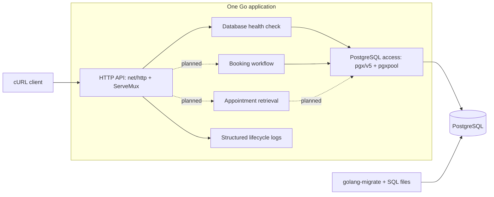

# Architecture

## Status and purpose

This document describes the selected design for the Unified Service Scheduler. It covers the architecture, component responsibilities, data flow, technology choices, observability strategy, and GenAI use during design.

The design choices below are recorded in [My decision](plan.md#my-decision). Domain assumptions and the [API contract](../api/README.md) are confirmed. The local environment, schema, demonstration data, and booking transaction are implemented and verified. Booking validation and PostgreSQL integration tests pass. HTTP creation, retrieval, and response mapping remain planned.

## Requirements

An appointment request identifies a customer, vehicle, dealership, service type, and desired start time. Before confirmation, the service must find a qualified technician and service bay available for the entire service duration. A successful booking persists those associations.

The design must protect against overlapping bookings through the supported API and make its assumptions and limitations explicit.

## Architecture diagram

Solid paths are implemented and verified. Dotted application paths show the next planned behavior.

## Components

| Component | Location | Status and responsibility |
| --- | --- | --- |
| Application entry point | `cmd/api/` | Implemented: load configuration, connect dependencies, start the HTTP server, and shut down cleanly. |
| HTTP API | `internal/httpapi/` | Health route implemented; appointment routing, validation, request IDs, and response mapping are planned. |
| Booking workflow | `internal/appointments/` | Implemented: validate IDs and RFC 3339 timestamps, normalize UTC, define results and domain errors, and call the atomic booking repository. |
| Catalog model | `internal/catalog/` | Planned: represent customers, vehicles, dealerships, service types, technicians, qualifications, and bays. |
| PostgreSQL access | `internal/postgres/` | Implemented: connection pool and booking transaction, including catalog checks, duration calculation, resource selection, insertion, commit, and rollback. |
| Configuration | `internal/config/` | Implemented: load and validate connection, timeout, pool, and server settings. |
| Schema and seed data | `database/` | Implemented: apply a reversible schema migration, load deterministic demonstration data, and verify constraints and indexes. |

These are packages within one application, not independent services. The booking service depends on a narrow `Creator` interface. PostgreSQL owns the entire allocation transaction so each query uses the same connection; booking code has no HTTP dependency.

## Selected technologies and rationale

| Choice | Version | Rationale |
| --- | --- | --- |
| Go | 1.27.1 | Selected implementation language for a single backend service. |
| `net/http` and `http.ServeMux` | Go standard library | Standard-library HTTP handling keeps the small API direct. |
| PostgreSQL | 18.6 on Alpine 3.23 | Relational persistence and transactions for appointments and resource associations. |
| `pgx/v5` and `pgxpool` | 5.11.0 | Explicit PostgreSQL access, transactions, and pooled connections. |
| `golang-migrate` and SQL files | 4.19.1 | Versioned, reviewable schema changes; introduced with the schema step. |
| Docker Compose | Compose v5 | Reproducible local application and database services with persistent storage. |
| cURL | Local client | A repeatable demonstration without a separate frontend. |

SQL keeps overlap checks and the locking protocol visible for review.

## Booking data flow

The service and transaction below are implemented; HTTP request handling and response mapping are Step 5 work.

1. The booking service receives input from its caller, eventually `POST /appointments`, validates positive integer IDs and an RFC 3339 start time with a timezone offset, normalizes it to UTC, and requires a future start time.
2. Begin a `READ COMMITTED` transaction through a pooled connection.
3. Lock the requested dealership row using `SELECT ... FOR UPDATE`. A missing dealership produces a missing-record outcome.
4. After obtaining the lock, validate catalog references and the vehicle's association with the supplied customer. Read the selected service duration and derive the appointment end time.
5. Select the lowest-ID qualified, available technician and the lowest-ID available bay at the dealership. For both resources, an overlap is `existing.start_time < requested.end_time AND existing.end_time > requested.start_time`. This considers the full interval and allows adjacent bookings.
6. If either resource is unavailable, roll back and return a capacity-conflict outcome.
7. Insert the appointment with both assignments and commit. After commit succeeds, return `201 Created`, a `Location` header, and the appointment representation.

All statements use the same `READ COMMITTED` transaction. A five-second context deadline bounds acquisition, lock waits, queries, and commit. Deferred rollback uses a separate two-second context so request cancellation does not prevent cleanup. Start time is rechecked after the dealership lock is acquired.

Input timestamps are normalized to UTC and truncated to PostgreSQL microsecond precision before validation and storage. End time is derived in SQL from the service duration. Returned times are UTC. Missing catalog rows, mismatched ownership, and no capacity have separate domain errors; unexpected SQL and commit errors retain their causes for the future HTTP error mapper.

`GET /appointments/{id}` returns `200 OK` with the same persisted appointment representation, without allocating resources. All returned timestamps are UTC RFC 3339 strings. See the confirmed [API contract](../api/README.md) for fields and error codes.

## Data model

| Entity | Responsibility |
| --- | --- |
| Customer | Customer associated with the booking. |
| Vehicle | Seeded vehicle receiving service, associated with a customer. |
| Dealership | Resource location and booking lock boundary. |
| ServiceType | Service duration and qualification association. |
| Technician | Technician assigned to one dealership. |
| TechnicianQualification | Direct association between a technician and an eligible service type. |
| ServiceBay | Bay assigned to one dealership. |
| Appointment | Customer, vehicle, dealership, service type, technician, bay, interval, and confirmed status. |

Catalog data is seeded and static. IDs use positive `bigint` identity columns, and appointment timestamps use `timestamptz`. Composite foreign keys enforce the customer/vehicle association, technician and bay dealership membership, and technician qualification for the selected service. Checks require positive service duration, a positive appointment interval, and `CONFIRMED` status.

B-tree indexes support catalog lookup and interval queries by dealership plus technician or bay. Overlap prevention is intentionally owned by the booking transaction rather than an exclusion constraint, because every supported writer will acquire the dealership row lock before checking both resources.

## Concurrency decision

All booking transactions acquire the dealership row lock before reading availability. Bookings at the same dealership therefore execute their allocation checks in sequence. Different dealerships have different lock rows.

At `READ COMMITTED`, later statements can observe changes committed before those statements start. After a waiting request acquires the dealership lock, its subsequent availability queries see the previous booking. This is the intended use of PostgreSQL's [row locks](https://www.postgresql.org/docs/current/explicit-locking.html#LOCKING-ROWS) and [statement snapshots](https://www.postgresql.org/docs/current/transaction-iso.html#XACT-READ-COMMITTED).

The guarantee depends on every booking writer using this protocol, each resource belonging to one dealership, and static catalog data. An in-process mutex is not the concurrency authority. The contention test observes six independent PostgreSQL sessions waiting on the dealership lock, then verifies one success, five conflicts, and one committed appointment.

### Tradeoffs and limits

- Requests for different resources at the same dealership still wait for one another. Keep the transaction short and bound waits with timeouts.
- Independent resource pairs can both succeed; serialization must not produce false capacity conflicts.
- Direct SQL writes that bypass the protocol are not protected by the locking workflow.
- A lost response after commit leaves the client uncertain about success. Automatic retries and idempotency are outside scope.
- The implementation does not claim a measured throughput or production capacity.

This choice prioritizes a small, reviewable transaction boundary. No comparison of multiple concurrency implementations is planned.

## Scope

Confirmed scope: two endpoints, seeded static catalog, confirmed-only appointments, server-side resource allocation, and a cURL client.

Authentication, catalog administration, cancellation, rescheduling, reservation holds, caching, notifications, and a separate availability endpoint are excluded. This is an assessment implementation, not a complete dealership scheduling product.

## Assumptions

The following assumptions are confirmed for the implementation.

### Time

Appointment start times use RFC 3339, must include a timezone offset, and are normalized to UTC by the application. Service duration is defined by the selected service type, and the server derives the appointment end time.

Appointment intervals use half-open semantics `[start, end)`, allowing back-to-back appointments. Start times must be in the future.

### Working Hours

For the scope of this assessment, technicians and service bays are assumed to be continuously available unless occupied by another appointment. Technician shifts, dealership opening hours, breaks, holidays, and bay maintenance schedules are outside scope.

### Customer and Vehicle

Customers and vehicles are seeded reference data. Each seeded vehicle is associated with a customer. The service validates that the requested vehicle belongs to the supplied customer before creating an appointment. Authentication and customer identity verification are outside scope.

## Observability and failure handling

The environment currently provides JSON lifecycle logs, bounded startup and health-check database pings, HTTP read-header and shutdown timeouts, a database-backed health route, and graceful signal handling.

The appointment API will add request IDs, operation outcomes, duration, and appointment IDs when available. It will avoid customer contact data and complete request bodies. Errors will contain an `error` object with `code`, `message`, and `request_id`; invalid input maps to `400`, missing records to `404`, capacity conflicts to `409`, known dependency unavailability to `503`, and unexpected failures to `500`.

The planned metrics strategy counts booking attempts, successes, capacity conflicts, and unexpected failures and measures request and transaction duration. Logs provide initial diagnostic evidence; no metrics exporter or dashboard is in scope. Request IDs will provide correlation inside this single service, and distributed tracing is not planned.

## Verification strategy

Current unit and PostgreSQL integration tests cover request validation, qualifications, dealership matching, UTC normalization, service-derived duration, overlap and adjacent intervals, customer/vehicle matching, alternate resources, and persisted associations. A deferred trigger injects a commit failure to verify rollback; a held dealership lock verifies cancellation. Each database test applies the migration in a temporary schema and cleans up that schema.

The concurrency test must use multiple database connections and verify committed appointments as well as responses. A clean-setup rehearsal will verify the documented commands and persistence across restart. See the [test plan](../tests/README.md).

## GenAI use during design

AI assisted with requirements analysis, scope comparison, identifying booking invariants, and drafting component boundaries. I selected the technologies and transaction strategy and limited the scope to a complete submission within the available time.

Review clarified that both resources must be allocated atomically and that availability checks must follow the dealership lock. The design records its contention and response-loss limitations. Environment, schema, and booking transaction behavior are verified. Review strengthened timestamp parsing and cancellation cleanup; HTTP integration and the remaining test-plan cases are still pending.
