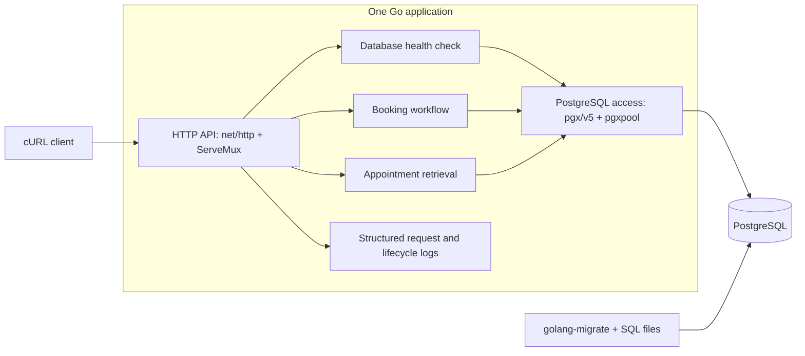

# Architecture

## Status and purpose

This document describes the implemented design for the Unified Service Scheduler. It covers the architecture, component responsibilities, data flow, technology choices, observability strategy, and GenAI use during design.

The design choices below are recorded in [My decision](plan.md#my-decision). Domain assumptions and the [API contract](../api/README.md) are confirmed. The local environment, schema, demonstration data, and booking transaction are implemented and verified. Booking validation, HTTP contracts, and PostgreSQL integration tests pass. Both appointment endpoints and the cURL workflow are implemented.

## Requirements

An appointment request identifies a customer, vehicle, dealership, service type, and desired start time. Before confirmation, the service must find a qualified technician and service bay available for the entire service duration. A successful booking persists those associations.

The design must protect against overlapping bookings through the supported API and make its assumptions and limitations explicit.

## Architecture diagram

The paths shown above are implemented and verified.

## Components

| Component | Location | Status and responsibility |
| --- | --- | --- |
| Application entry point | `cmd/api/` | Implemented: load configuration, connect dependencies, start the HTTP server, and shut down cleanly. |
| HTTP API | `internal/httpapi/` | Implemented: health and appointment routes, bounded JSON decoding, request IDs, response mapping, and request logs. |
| Booking workflow | `internal/appointments/` | Implemented: validate IDs and RFC 3339 timestamps, normalize UTC, define results and domain errors, and call the atomic booking repository. |
| PostgreSQL access | `internal/postgres/` | Implemented: connection pool and booking transaction, including catalog checks, duration calculation, resource selection, insertion, commit, rollback, and appointment retrieval. |
| Configuration | `internal/config/` | Implemented: load and validate connection, timeout, pool, and server settings. |
| Schema and seed data | `database/` | Implemented: apply a reversible schema migration, load deterministic demonstration data, and verify constraints and indexes. |

The Go components run in one application. The booking service depends on a `Repository` interface with creation and retrieval. The PostgreSQL repository owns the entire allocation transaction so each query uses the same connection; booking code has no HTTP dependency. Catalog relationships are represented by SQL tables and checked within that transaction.

## Selected technologies and rationale

| Choice | Version | Rationale |
| --- | --- | --- |
| Go | 1.27.1 | Selected implementation language for a single backend service. |
| `net/http` and `http.ServeMux` | Go standard library | Standard-library HTTP handling keeps the small API direct. |
| PostgreSQL | 18.6 on Alpine 3.23 | Relational persistence and transactions for appointments and resource associations. |
| `pgx/v5` and `pgxpool` | 5.11.0 | Explicit PostgreSQL access, transactions, and pooled connections. |
| `golang-migrate` and SQL files | 4.19.1 | Versioned SQL changes that can be applied and rolled back independently of application startup. |
| Docker Compose | Compose v5 | Reproducible local application and database services with persistent storage. |
| cURL | Local client | A repeatable demonstration without a separate frontend. |

SQL keeps overlap checks and the locking protocol visible for review.

## Booking data flow

The HTTP handlers, booking service, and transaction below are implemented.

1. `POST /appointments` validates its JSON body and passes input to the booking service, which validates positive integer IDs and an RFC 3339 start time with a timezone offset, normalizes it to UTC, and requires a future start time.
2. Begin a `READ COMMITTED` transaction through a pooled connection.
3. Lock the requested dealership row using `SELECT ... FOR UPDATE`. A missing dealership produces a missing-record outcome.
4. After obtaining the lock, validate catalog references and the vehicle's association with the supplied customer. Read the selected service duration and derive the appointment end time.
5. Select the lowest-ID qualified, available technician and the lowest-ID available bay at the dealership. For both resources, an overlap is `existing.start_time < requested.end_time AND existing.end_time > requested.start_time`. This considers the full interval and allows adjacent bookings.
6. If either resource is unavailable, roll back and return a capacity-conflict outcome.
7. Insert the appointment with both assignments and commit. After commit succeeds, return `201 Created`, a `Location` header, and the appointment representation.

All statements use the same `READ COMMITTED` transaction. A five-second context deadline bounds acquisition, lock waits, queries, and commit. Deferred rollback uses a separate two-second context so request cancellation does not prevent cleanup. Start time is rechecked after the dealership lock is acquired.

Input timestamps are normalized to UTC and truncated to PostgreSQL microsecond precision before validation and storage. End time is derived in SQL from the service duration. Returned times are UTC. Missing catalog rows, mismatched ownership, and no capacity have separate domain errors; unexpected SQL and commit errors retain their causes. The HTTP layer returns fixed public messages; connection failures and database wait deadlines map to `503`, while unexpected SQL or constraint failures map to `500`.

`GET /appointments/{id}` returns `200 OK` with the same persisted appointment representation, without allocating resources. All returned timestamps are UTC RFC 3339 strings. See the confirmed [API contract](../api/README.md) for fields and error codes.

## Data model

| Entity | Responsibility |
| --- | --- |
| Customer | Customer associated with the booking. |
| Vehicle | Seeded vehicle receiving service, associated with a customer. |
| Dealership | Resource location and booking lock boundary. |
| ServiceType | Service duration and qualification association. |
| Technician | Technician assigned to one dealership. |
| TechnicianQualification | Direct association between a technician and an eligible service type. |
| ServiceBay | Bay assigned to one dealership. |
| Appointment | Customer, vehicle, dealership, service type, technician, bay, interval, and confirmed status. |

Catalog data is seeded and static. IDs use positive `bigint` identity columns, and appointment timestamps use `timestamptz`. Composite foreign keys enforce the customer/vehicle association, technician and bay dealership membership, and technician qualification for the selected service. Checks require positive service duration, a positive appointment interval, and `CONFIRMED` status.

B-tree indexes support catalog lookup and interval queries by dealership plus technician or bay. Overlap prevention is intentionally owned by the booking transaction rather than an exclusion constraint, because every supported writer will acquire the dealership row lock before checking both resources.

## Concurrency decision

All booking transactions acquire the dealership row lock before reading availability. Bookings at the same dealership therefore execute their allocation checks in sequence. Different dealerships have different lock rows.

At `READ COMMITTED`, later statements can observe changes committed before those statements start. After a waiting request acquires the dealership lock, its subsequent availability queries see the previous booking. This is the intended use of PostgreSQL's [row locks](https://www.postgresql.org/docs/current/explicit-locking.html#LOCKING-ROWS) and [statement snapshots](https://www.postgresql.org/docs/current/transaction-iso.html#XACT-READ-COMMITTED).

The guarantee depends on every booking writer using this protocol, each resource belonging to one dealership, and static catalog data. PostgreSQL coordinates the writers. Tests observe six independent sessions waiting on the dealership lock, then verify one or two successes according to resource capacity, the remaining capacity conflicts, and matching committed rows.

### Tradeoffs and limits

- Requests for different resources at the same dealership still wait for one another. Keep the transaction short and bound waits with timeouts.
- Independent resource pairs can both succeed after serialization; the HTTP capacity matrix verifies this behavior.
- Direct SQL writes that bypass the protocol are not protected by the locking workflow.
- A lost response or connection failure during commit can leave the client uncertain whether a booking exists. There is no idempotency key or automatic retry; another POST may create an additional booking if capacity remains.
- The implementation does not claim a measured throughput or production capacity.

This choice keeps resource allocation within one short, reviewable transaction boundary.

## Scope

Confirmed scope: two endpoints, seeded static catalog, confirmed-only appointments, server-side resource allocation, and a cURL client.

Authentication, catalog administration, cancellation, rescheduling, reservation holds, caching, notifications, and a separate availability endpoint are excluded. The implementation covers the assessment booking workflow.

## Assumptions

The following assumptions are confirmed for the implementation.

### Time

Appointment start times use RFC 3339, must include a timezone offset, and are normalized to UTC by the application. Service duration is defined by the selected service type, and the server derives the appointment end time.

Appointment intervals use half-open semantics `[start, end)`, allowing back-to-back appointments. Start times must be in the future.

### Working Hours

For the scope of this assessment, technicians and service bays are assumed to be continuously available unless occupied by another appointment. Technician shifts, dealership opening hours, breaks, holidays, and bay maintenance schedules are outside scope.

### Customer and Vehicle

Customers and vehicles are seeded reference data. Each seeded vehicle is associated with a customer. The service validates that the requested vehicle belongs to the supplied customer before creating an appointment. Authentication and customer identity verification are outside scope. Overlap checks protect technician and bay occupancy; customer and vehicle exclusivity are not modeled.

## Observability and failure handling

The environment currently provides JSON lifecycle logs, bounded startup and health-check database pings, HTTP read-header and shutdown timeouts, a database-backed health route, and graceful signal handling.

The appointment API generates request IDs and logs route templates, method, status, error code, and duration without request bodies, URL queries, or customer contact data. Successful creation and retrieval also log the persisted `appointment_id`. The request ID appears in `X-Request-ID` and the JSON error envelope. Successful requests and expected client outcomes use `INFO`; `500` and `503` outcomes use `ERROR`. Health failures retain their separate response body and log `SERVICE_UNAVAILABLE`.

Invalid input maps to `400`, missing records to `404`, capacity conflicts to `409`, known dependency unavailability and database operation deadlines to `503`, and unexpected failures to `500`. Public errors use fixed messages and do not expose raw database details. POST bodies are limited to 64 KiB and one JSON object with documented fields.

| Operation | Limit | Configuration |
| --- | --- | --- |
| HTTP headers | 5 seconds by default | `HTTP_READ_HEADER_TIMEOUT` |
| HTTP request read, including body | 10 seconds | Fixed server setting |
| HTTP response write | 15 seconds | Fixed server setting |
| HTTP idle connection | 60 seconds | Fixed server setting |
| Startup database ping and new connection handshake | 5 seconds each by default | `DB_CONNECT_TIMEOUT` |
| Health database ping | 2 seconds by default | `DB_PING_TIMEOUT` |
| Booking or retrieval database operation | 5 seconds | Includes pool acquisition, locks, queries, and commit |
| Booking rollback cleanup | 2 seconds | Independent of the cancelled request context |
| Graceful HTTP shutdown | 10 seconds by default | `HTTP_SHUTDOWN_TIMEOUT` |

The connection timeout is applied to the pool's connection configuration as well as the startup ping. Background connection creation can outlive the acquiring request, so it needs its own handshake deadline. Tests verify stalled handshakes, booking-lock/query/pool waits, no extra persisted rows after timeout, and successful requests after resources are released. Live checks verify slow-header/body termination and safe database outage/recovery behavior.

Implemented observability consists of request/lifecycle logs and the database-backed health route. Logs expose request duration and HTTP outcomes, allowing successes, conflicts, and failures to be distinguished. Transaction-duration metrics, a metrics exporter, dashboards, and distributed tracing are outside scope.

## Verification strategy

Current unit and PostgreSQL integration tests cover request validation, qualifications, dealership matching, UTC normalization, service-derived duration, overlap and adjacent intervals, customer/vehicle matching, alternate resources, and persisted associations. The interval matrix independently checks technicians and bays for containment, adjacency in both directions, and microsecond overlaps. Tests also verify equivalent offset representations, independent resource alternatives, and bookings outside conventional opening hours. A deferred trigger injects a commit failure to verify rollback; a held dealership lock verifies cancellation. Each database test applies the migration in a temporary schema and cleans up that schema. HTTP integration tests verify `201`/`Location`, identical retrieval, UTC responses, invalid and missing references, capacity conflicts, and failed-commit `500` responses. A live database stop/restart rehearsal verified `503` for both endpoints and successful retrieval after recovery.

Concurrency tests observe six independent PostgreSQL sessions waiting before releasing the dealership lock. HTTP outcomes match resource capacity, successful responses match retrieval, and committed rows have no technician or bay overlaps. A booking at another dealership commits while the first dealership remains locked. A test-only deferred trigger pauses and fails a commit while another request waits; only the waiting request persists, using the released resources. These cases pass five repeated runs with race detection. A clean-setup rehearsal will verify the documented commands and persistence across restart. See the [test plan](../tests/README.md).

## GenAI use during design

I used AI to compare scope and concurrency choices, identify booking invariants, and draft component boundaries. I selected a single Go/PostgreSQL service and a dealership row lock to keep allocation atomic and the implementation reviewable.

Review made the ordering requirement explicit: acquire the lock before availability queries so their `READ COMMITTED` snapshots include the previous booking. Verification then used observed lock waiters, committed-row checks, and a failed commit with another request queued behind it. The design records the resulting guarantee alongside dealership contention, static-catalog assumptions, and uncertain outcomes when a commit response is lost.
